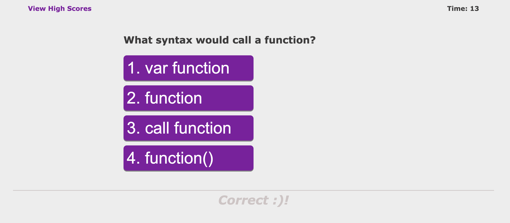

# WebAPIs_CodeQuiz

## Description

* As a developer, I wanted to create a web application that would generate coding quiz questions along with other features such as creating and removing highscores, and visual proof of it being correct or incorrect.

## Acceptance Criteria

```
GIVEN I am taking a code quiz
WHEN I click the start button
THEN a timer starts and I am presented with a question
WHEN I answer a question
THEN I am presented with another question
WHEN I answer a question incorrectly
THEN time is subtracted from the clock
WHEN all questions are answered or the timer reaches 0
THEN the game is over
WHEN the game is over
THEN I can save my initials and my score
```

## Usage

* This webpage can be used to test one's knowledge on coding skills as well as record and log their highscores.

* Link: 

* Screenshots:
    
    
    
    


## Credits

* I worked on this project with some assistance from classmate Edward Kim. I also referenced a previous student's work as a guide in this process by means of reverse engineering code. <a href="https://github.com/Achigas/CodeQuiz-Challenge4">Code Quiz Challenge</a>